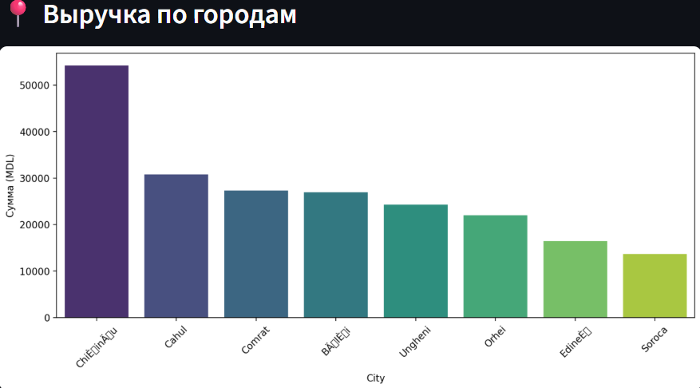
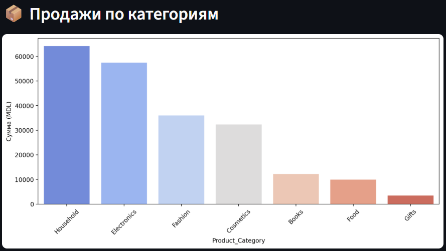
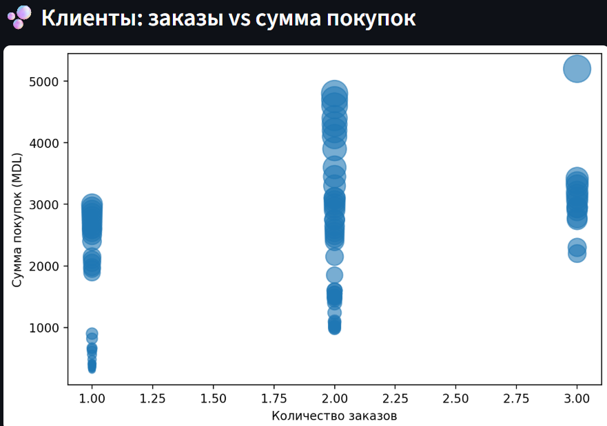
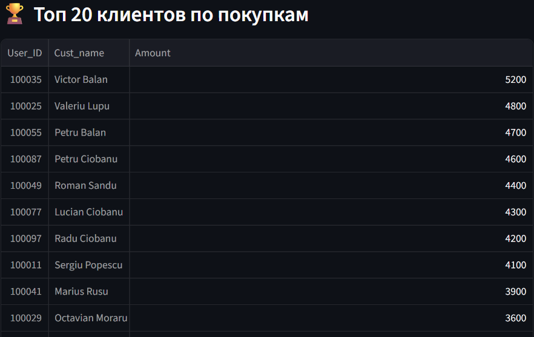

## Project Structure

- `app.py` — Streamlit application entry point  
- `Retail_Sales_Analysis_Moldova.ipynb` — exploratory data analysis notebook  
- `products.csv` — synthetic product-level dataset  
- `README.md` — project documentation  
- `.gitignore` — ignored files and directories

# Retail Sales Analysis – Republic of Moldova

This repository contains a retail sales analysis project based on a synthetic dataset representing customer purchases in the Republic of Moldova.

The project focuses on data preparation, aggregation, and visualization to identify patterns in customer behavior, sales distribution, and order volume.  
The analysis is implemented using Python and presented both as a Jupyter Notebook and an interactive Streamlit application.

## Project Scope

The analysis covers:
- Distribution of sales by gender and age group
- Order frequency and purchase amount analysis
- Regional and product-level aggregation
- Basic customer segmentation based on transactional data

The dataset is synthetic and created for educational and portfolio purposes.

## Data Visualizations

### Revenue by City

**Insight:**  
Chișinău generates the highest retail revenue, significantly outperforming other cities. This reflects higher population density and purchasing activity. Mid-sized cities such as Cahul and Comrat show moderate revenue levels, while smaller cities contribute a lower share.

### Sales by Product Category

**Insight:**  
Household goods and electronics account for the largest share of total sales, indicating strong demand for essential and high-value products. Categories such as books and gifts contribute comparatively less to overall revenue.

### Orders vs Revenue per Customer

**Insight:**  
Customers with a higher number of orders generally generate higher total revenue. However, several customers with fewer orders still show high spending, indicating the presence of high-value purchases.

### Gender and Age Group Heatmap

**Insight:**  
The most active purchasing segment is the 26–35 age group. Female customers dominate in younger segments, while male customers show higher activity in the 36–45 and 46–55 age groups.

### Top 20 Customers by Revenue

**Insight:**  
A small group of top customers contributes a disproportionately large share of total revenue, highlighting the importance of customer retention and loyalty strategies.

## Technologies Used

- Python
- Pandas, NumPy
- Matplotlib, Seaborn
- Streamlit
- Jupyter Notebook

## Notes

This project is intended to demonstrate practical data analysis and visualization skills.  
All data used is artificial and does not represent real individuals or commercial transactions.
Based on an initial public dataset, fully reworked and extended for analytical purposes.

## How to run
1. Install dependencies:

    pip install pandas numpy matplotlib seaborn streamlit

2. Run the Streamlit application:

    streamlit run app.py
